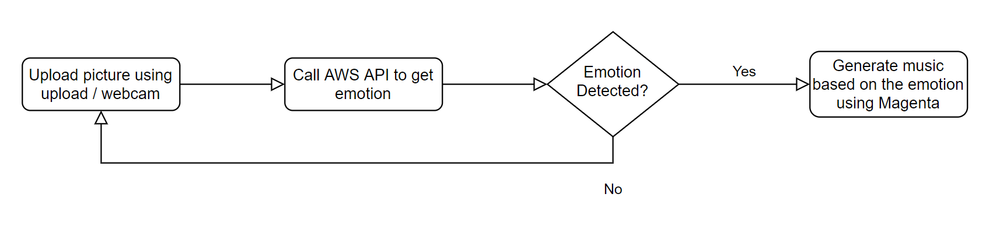

# AI Challenge - play music based on emotions

## ℹ About this project

- This project is an AI-based challenge where we determine the emotion of a given picture and play a generated song using AI that empowers the emotion.

## 📈 Flowchart

😀 Happy
😥 Sad
😠 Angry
😵 Confused
🤢 Disgusted
😦 Surprised
😐 Calm
❓ Unknown
😨 Fear

## 💾 Technologies

- Node.js - version: 15.5.1
- Python - version: 3.7
- Flask - version: 1.1.2

## ⚡ API

- [AWS rekognition API](https://docs.aws.amazon.com/rekognition/latest/dg/faces-detect-images.html)
